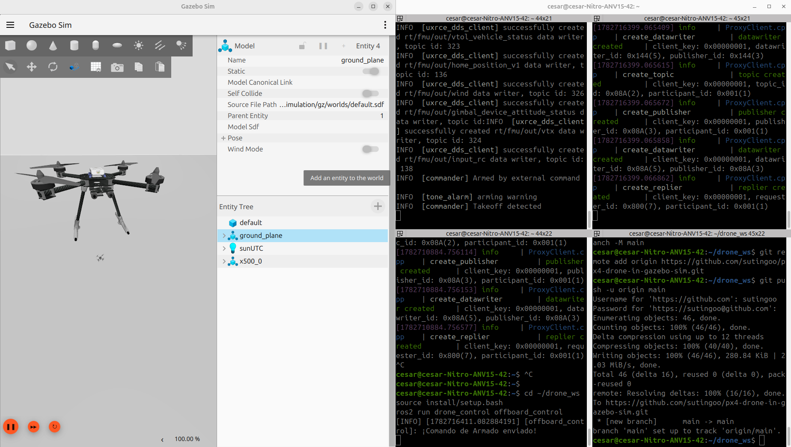

# PX4 Drone in Gazebo Sim

A Software-In-The-Loop (SITL) architecture for aerial robotics, bridging the deterministic, real-time world of flight control (**PX4**) with the asynchronous, high-level world of robotics middleware (**ROS 2**).

This is not just "a script that flies a drone." It's the connective tissue between two fundamentally different computational paradigms — and the foundation for a long-term research path toward autonomous, learning-based flight.



---

## Table of Contents

- [Overview](#overview)
- [Core Philosophy](#core-philosophy)
- [Architecture](#architecture)
- [Tech Stack](#tech-stack)
- [Repository Structure](#repository-structure)
- [Prerequisites](#prerequisites)
- [Getting Started](#getting-started)
- [Roadmap](#roadmap)
- [Long-Term Vision](#long-term-vision)
- [Contributing](#contributing)
- [License](#license)

---

## Overview

This repository unites two computational worlds:

- **The low-level deterministic world (PX4):** a real-time firmware (RTOS) designed for flight controllers. Its only job is to keep the drone stable in the air — reading gyroscopes and accelerometers at hundreds of hertz and driving the motors accordingly.
- **The high-level asynchronous world (ROS 2):** a decentralized middleware (DDS) designed for heavy computation — computer vision, neural networks, trajectory planning.

This project is the bridge between them: a ROS 2-based control stack that commands a PX4-powered multirotor simulated in **Gazebo**, communicating over the **Micro XRCE-DDS** bridge.

## Core Philosophy

The central design principle of this project is to **decouple flight stabilization from flight intelligence**.

PX4 acts as an intrinsically stable controller — it never receives raw motor commands from the high-level stack. Instead, ROS 2 acts as the "forward brain": it makes tactical decisions (*where to go*) and delegates physical execution (*how to get there, motor by motor*) entirely to PX4.

This mirrors the same separation used in modern legged-robot control, where a high-level planner issues stable, model-consistent targets to a low-level controller responsible for balance and actuation — rather than micromanaging every joint or motor directly. Here, PX4 plays the role of that intrinsically stable low-level controller for an aerial platform.

## Architecture

The system is organized into four strict layers, each blind to the implementation details of the others:

```
┌─────────────────────────────────────────────────────────┐
│  1. Application Layer (drone_control package)            │
│     offboard_control.cpp — async timer @ 20 Hz (50 ms)   │
│     Decides WHERE to go. Blind to HOW the drone flies.    │
├─────────────────────────────────────────────────────────┤
│  2. Translation Layer (px4_msgs)                         │
│     Compiled dictionary: native C++ structs ⇄ DDS-        │
│     serializable message types.                          │
├─────────────────────────────────────────────────────────┤
│  3. Transport Layer (Micro XRCE-DDS)                      │
│     UDP tunnel that encapsulates ROS 2 messages and       │
│     injects them into PX4's internal uORB bus.            │
├─────────────────────────────────────────────────────────┤
│  4. Execution Layer (PX4 SITL)                            │
│     Receives setpoints (e.g. "go to Z = -5.0 m").         │
│     Internal PID loops command the 4 motors to comply.    │
└─────────────────────────────────────────────────────────┘
                          │
                          ▼
                  Gazebo Sim (physics)
```

**Data flow in short:** ROS 2 node → `px4_msgs` → Micro XRCE-DDS Agent (UDP) → PX4 uORB → PID controllers → simulated motors in Gazebo → telemetry flows back up the same path.

The application layer publishes continuous setpoints in the **NED** (North-East-Down) reference frame, which PX4 expects natively for offboard control.

## Tech Stack

| Layer | Technology |
|---|---|
| OS | Ubuntu 24.04 |
| Robotics middleware | ROS 2 Jazzy |
| Flight stack | PX4 Autopilot (SITL) |
| Bridge | Micro XRCE-DDS Agent |
| Simulator | Gazebo Sim (Harmonic) |
| Application language | C++ |
| Build system | CMake / colcon |

## Repository Structure

```
px4-drone-in-gazebo-sim/
├── src/        # ROS 2 workspace source (drone_control package, offboard control node)
├── log/        # Build / run logs
└── .gitignore
```

> This is an active workspace, structure will expand as new packages (perception, navigation, learning) are added.

## Prerequisites

- Ubuntu 24.04
- [ROS 2 Jazzy](https://docs.ros.org/en/jazzy/Installation.html)
- [PX4 Autopilot](https://docs.px4.io/main/en/dev_setup/getting_started.html) (built for SITL)
- [Micro XRCE-DDS Agent](https://github.com/eProsima/Micro-XRCE-DDS-Agent)
- [Gazebo Sim (Harmonic)](https://gazebosim.org/docs/harmonic/install_ubuntu/)
- `px4_msgs` (built in the same ROS 2 workspace)

## Getting Started

1. **Start PX4 SITL with Gazebo:**
   ```bash
   cd ~/PX4-Autopilot
   make px4_sitl gz_x500
   ```

2. **Launch the Micro XRCE-DDS Agent** (bridges PX4 uORB ↔ ROS 2 DDS):
   ```bash
   MicroXRCEAgent udp4 -p 8888
   ```

3. **Build the ROS 2 workspace:**
   ```bash
   cd px4-drone-in-gazebo-sim
   colcon build
   source install/setup.bash
   ```

4. **Run the offboard control node:**
   ```bash
   ros2 run drone_control offboard_control
   ```

> Exact package/node names will be kept up to date as the `src/` workspace evolves — see the source for the current entry point.

## Roadmap

### Short-term (Phases 1–3) — in progress

- [x] **Bidirectional data pipeline** — telemetry and commands flowing reliably through the Micro XRCE-DDS bridge with no critical latency.
- [x] **Offboard control mastery** — a C++ node successfully substituting for a human pilot via continuous setpoint injection at a strict 20 Hz rate.
- [ ] **Baseline parametric navigation** — full vehicle control in the NED frame for kinematic validation, including robust landing logic.

### Long-term (Phases 4–6)

- [ ] **Simulated sensor integration** — processing LiDAR point clouds or depth-camera streams from Gazebo Harmonic.
- [ ] **Dynamic obstacle avoidance** — replacing static setpoints (e.g. "climb 5 meters") with real-time avoidance algorithms.
- [ ] **AI-based autonomy** — Python nodes implementing continuous reinforcement learning (e.g. PPO), enabling the drone to navigate wind gusts and large disturbances, inspired by Experience Variability (EV) for fast adaptation across tasks. Target: once the C++ baseline is rock-solid.

## Long-Term Vision

The long-term goal of this project is a research-grade autonomy stack (with an eye toward venues like **IROS**): a drone that, much like recent intrinsically-stable model-predictive-control approaches in legged robotics, separates *stability* (handled by PX4) from *intelligence* (handled by learning-based ROS 2 nodes) — and can generalize to disturbances it wasn't explicitly programmed for.

## Contributing

This is primarily a personal research and learning project, but issues, suggestions, and discussion are welcome. Feel free to open an issue if you spot a bug or want to discuss the architecture.

## License

No license has been specified yet for this repository. All rights reserved by default until a license is added.

---

**Author:** [sutingoo](https://github.com/sutingoo)
